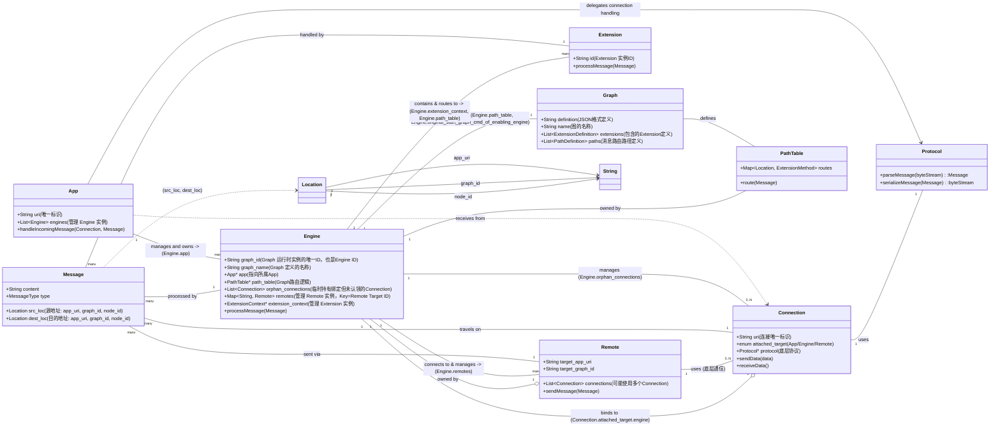

## `ten-framework` 中这些核心模型之间的联系

### `ten-framework` 核心模型及其联系

`ten-framework` 的设计旨在构建可伸缩、多语言的分布式服务。它通过一系列精心设计的抽象来管理消息流、业务逻辑执行和组件生命周期。

**1. `App` (应用): 整个服务的管理者**

- **定位:** `App` 是 `ten-framework` 服务进程中的顶层容器和协调者。你的 `ten-framework` 服务启动时，会初始化一个或少数几个 `App` 实例。
- **职责:**
  - 管理一个或多个 `Engine` 实例的生命周期（创建、销毁）。
  - 接收所有外部传入的连接 (`Connection`)。
  - 根据传入的第一个消息（例如 `start_graph` `Command`），初步路由 `Connection` 到相应的 `Engine`。

**2. `Connection` (连接) & `Protocol` (协议): 外部通信的桥梁**

- **`Connection`:**
  - **定位:** 代表客户端与 `ten-framework` 服务之间的**一条物理或逻辑通信链路**（例如 WebSocket 连接）。
  - **职责:** 负责管理这条通信通道的生命周期，以及通过它进行的原始数据传输。
- **`Protocol`:**
  - **定位:** 负责 `Connection` 层面上的**协议解析和数据转换**。
  - **职责:** 将网络上收到的原始字节流**序列化/反序列化**为 `ten-framework` 内部的 `Message` 格式，反之亦然。例如，`WebsocketProtocol` 负责处理 WebSocket 帧。
- **联系:** `Connection` 依赖于 `Protocol` 来实现具体的网络通信细节。当一个外部连接建立时，首先由 `Protocol` 创建和管理 `Connection` 实例。

**3. `Message` & `Command`: 内部通信的数据单元**

- **`Message`:** `ten-framework` 内部所有数据传输的基本单元。它包含数据负载和重要的路由信息（如源和目的地）。
- **`Command`:** 一种特殊类型的 `Message`，用于向框架发出指令，例如 `start_graph` 用于启动一个图。
- **联系:** 客户端通过 `Connection` 发送的请求，会被 `Protocol` 解析为 `Message` 或 `Command`，然后在框架内部流转。

**4. `Graph` (图): 业务逻辑的蓝图**

- **定位:** `Graph` 是对特定业务逻辑处理流程的**静态定义或蓝图**（通常是 JSON 格式）。它描述了：
  - 包含哪些处理组件（`Extension`）。
  - 这些组件之间的数据流向（`Path` / `Route`）。
  - 它**不是**一个运行时实例，而是一个抽象的概念。

**5. `Engine` (引擎): 图的运行时实例**

- **定位:** `Engine` 是 `Graph` 的**运行时实例**，它是一个独立的执行环境，用于加载、管理和运行一个特定的 `Graph` 所定义的业务逻辑。
- **职责:**
  - 当一个 `start_graph` `Command` 进来时，`App` 会根据 `Command` 中指定的 `Graph ID`（这个 ID 唯一标识一个逻辑图实例）查找现有 `Engine`。
  - **如果不存在对应的 `Engine`:** `App` 会创建一个新的 `Engine` 实例，并为其分配一个唯一的 `Graph ID`。这个 `Engine` 会根据 `Graph` 的定义加载其内部的 `Extension`。
  - **如果存在：** `App` 确定使用已有的 `Engine`。
  - `Engine` 内部有一个 **`Path Table`**，它是 `Graph` 定义在运行时层面的具体实现，用于指导消息在 `Extension` 之间的精确路由。
  - `Engine` 通常拥有自己的**单线程事件循环**（或共享 `App` 的循环），负责顺序处理其输入队列中的所有消息，并分发给对应的 `Extension`。
- **联系:** `Engine` 是 `Graph` 抽象的具象化和执行者。一个 `App` 可以承载并管理多个 `Engine` 实例，每个 `Engine` 运行一个独立的 `Graph` 逻辑流。

**6. `Thread Migration` (线程迁移): 连接归属的转移**

- **定位:** 这是 `Connection` 与 `Engine` 建立运行时绑定的关键步骤。
- **过程:** 当一个 `Connection` 接收到第一个需要由特定 `Engine` 处理的 `Message` (例如 `start_graph` `Command` 或业务消息) 时，`App` 会将这个 `Connection` 的管理权从 `App` 层转移到目标 `Engine`。此后，这个 `Connection` 的所有后续消息都将直接路由到该 `Engine` 的输入队列。
- **意义:** 确保特定 `Connection` 的所有消息都在其绑定的 `Engine` 的线程中处理，优化了资源利用和并发模型。

**7. `orphan_connections` (孤儿连接): `Engine` 对连接的临时持有**

- **定位:** `Engine` 内部的一个列表，用于临时持有那些已经与该 `Engine` 绑定，但尚未在 `Engine` 内部被某个 `Remote` 实例明确关联的 `Connection`。
- **职责:** 在 `Connection` 迁移到 `Engine` 后，但尚未与具体业务逻辑中的 `Remote` 端点完全匹配之前，`orphan_connections` 确保 `Engine` 能够正确地处理来自这些 `Connection` 的传入消息，并向其发送回传消息。

**8. `Extension` (扩展): 图中的处理单元**

- **定位:** `Graph` 中定义的具体业务逻辑处理组件（例如音频解码器、AI 推理模块）。
- **职责:** 接收 `Engine` 路由过来的 `Message`，执行特定的处理逻辑，并可能生成新的 `Message` 返回给 `Engine` 进行后续路由。
- **联系:** `Extension` 实例由 `Engine` 加载和管理，并在 `Engine` 的单线程上下文中执行。多个 `Connection` 的消息可能被同一个 `Engine` 内部的同一套 `Extension` 实例处理。

**9. `Path` & `Route` & `Path Table`: 消息在图内的流向**

- **定位:** `Graph` 定义了消息如何在一个 `Engine` 内部的 `Extension` 之间流转。
- **`Path Table`:** `Engine` 内部的数据结构，是 `Graph` 定义中消息路由规则的具体实现。`Engine` 根据消息的目的地和 `Path Table` 来决定将消息分发到哪个 `Extension`。
- **联系:** `Message` 在 `Engine` 内部的生命周期，就是沿着 `Path Table` 定义的 `Route` 在不同的 `Extension` 之间传递。

**10. `Remote` (远端): 跨实体通信的抽象**

- **定位:** 从 `Engine` 的视角来看，`Remote` 是一个**逻辑上的“远端通信端点”**。
- **职责:**
  - 封装了与另一个 `Engine`、另一个 `App` 或外部客户端进行通信所需的所有高级信息和策略。
  - 当 `Engine` 内部的 `Extension` 需要发送消息回溯到发起请求的 `Connection` 另一端时，或者需要发送消息到另一个 `Engine` 时，它会通过一个 `Remote` 实例来表示这个通信目标。
  - 一个 `Remote` 可以管理一个或多个底层 `Connection` 来实现通信。
- **联系:** `Remote` 使得 `Engine` 能够以更高级的语义与其他 `Engine` 或外部实体交互，无需直接关心底层的 `Connection` 或 `Protocol` 细节。它负责将 `Engine` 内部的输出 `Message` 转发到正确的 `Connection` 或其他 `Remote`。

---

**核心流程总结（从前端到 `Extension` 再回前端）：**

1.  **前端连接:** 前端建立 WebSocket 连接，`Protocol` 创建 `Connection`。
2.  **第一个 `Command`:** 前端发送 `start_graph` `Command` (`Message`)。
3.  **`App` 路由与 `Engine` 实例化:** `App` 接收 `Command`，决定是创建新 `Engine` (承载 `Graph`) 还是使用现有 `Engine`。
4.  **`Connection` 绑定与迁移:** `Connection` 迁移并绑定到目标 `Engine`（可能暂存于 `orphan_connections`）。
5.  **后续 `Message` 入 `Engine`:** 前端发送的后续数据 `Message` 直接进入绑定 `Engine` 的输入队列。
6.  **`Engine` 内部处理:** `Engine` 线程从队列取出 `Message`，根据 `Path Table` 路由到 `Extension`。
7.  **`Extension` 处理并发送响应:** `Extension` 处理数据，生成响应 `Message`，提交回 `Engine`。
8.  **`Engine` 回传 (`Remote` 介入):** `Engine` 根据响应 `Message` 的目的地，通过为该 `Connection` 关联的 `Remote` 实例，将 `Message` 发送出去。
9.  **`Protocol` & `Connection` 回传前端:** `Remote` 使用底层 `Connection` 和 `Protocol` 将 `Message` 序列化并发送回前端。

### `ten-framework` 模型之间的对应细节

#### 1. `App` 与 `Engine` (多对一关系：一个 App 管理多个 Engine)

- **App 侧维护的联系：**
  - **字段：** `core/include_internal/ten_runtime/app/app.h`
    ```c
    59|typedef struct ten_app_t {
    // ... existing code ...
    75|  ten_list_t engines; // ten_engine_t* 实例的列表
    // ... existing code ...
    122|  ten_string_t uri; // App 的唯一标识 URI
    // ... existing code ...
    } ten_app_t;
    ```
  - **如何维护：** `App` 结构体中有一个 `ten_list_t engines` 列表，它存储了所有由该 `App` 实例创建和管理的 `ten_engine_t` 实例的指针。
  - **查找机制：** 当 `start_graph` 命令到达时，`App` 会调用 `ten_app_get_engine_by_graph_id(self, const char *graph_id)` (`core/include_internal/ten_runtime/app/engine_interface.h`) 来根据 `graph_id` 遍历 `engines` 列表，查找对应的 `Engine`。

- **Engine 侧维护的联系：**
  - **字段：** `core/include_internal/ten_runtime/engine/engine.h`
    ```c
    35|struct ten_engine_t {
    // ... existing code ...
    48|  ten_app_t *app; // 指向其所属的 App 实例
    // ... existing code ...
    67|  ten_string_t graph_id; // Engine 的唯一 ID，也是其承载的 Graph 的运行时 ID
    // ... existing code ...
    } ten_engine_t;
    ```
  - **如何维护：** 每个 `Engine` 实例都包含一个 `ten_app_t *app` 指针，指向创建并管理它的 `App` 实例。同时，每个 `Engine` 都有一个唯一的 `ten_string_t graph_id`，这个 ID 标识了它承载的 `Graph` 的运行时实例。

- **总结：** `App` 通过 `engines` 列表存储 `Engine` 指针，并使用 `Engine` 的 `graph_id` 进行查找。`Engine` 则通过 `app` 指针指向其父 `App`，并以 `graph_id` 作为自身的唯一标识符。

#### 2. `Engine` 与 `Graph` (一对一关系：一个 Engine 承载一个 Graph 实例)

- **Engine 侧维护的联系：**
  - **字段：** `core/include_internal/ten_runtime/engine/engine.h`
    ```c
    35|struct ten_engine_t {
    // ... existing code ...
    64|  ten_string_t graph_name; // Graph 的名称
    67|  ten_string_t graph_id; // Graph 的运行时唯一 ID，也是 Engine 的 ID
    70|  ten_path_table_t *path_table; // 承载 Graph 的路由逻辑
    // ... existing code ...
    75|  ten_shared_ptr_t *original_start_graph_cmd_of_enabling_engine; // 启动该 Engine 的原始 start_graph 命令
    // ... existing code ...
    } ten_engine_t;
    ```
  - **如何维护：**
    - `Engine` 的 `graph_id` 字段直接就是 `Graph` 在运行时的唯一标识符。
    - `Engine` 的 `path_table` 字段存储了 `Graph` 定义中的所有路由规则。`Path Table` 是 `Graph` 的运行时具象化，指导消息在 `Extension` 之间的流转。
    - `original_start_graph_cmd_of_enabling_engine` 字段保存了用于创建和配置该 `Engine`（及其承载的 `Graph`）的完整 `start_graph` `Command`。这个 `Command` 包含了 `Graph` 的所有定义信息（例如 `graph_json`、`extensions_info` 等）。

- **总结：** `Graph` 作为抽象定义，其运行时实例的概念与 `Engine` 紧密绑定。`Engine` 使用 `graph_id` 作为 `Graph` 实例的唯一标识，并利用 `path_table` 来执行 `Graph` 定义的路由逻辑。

#### 3. `Connection` 与 `Engine` (多对一关系：多个 Connection 可以绑定到同一个 Engine)

- **Connection 侧维护的联系：**
  - **字段：** `core/include_internal/ten_runtime/connection/connection.h` (这个文件之前被读取过，确认 `connection` 结构中包含 `attached_target` 字段)
    ```c
    30|struct ten_connection_t {
    // ... existing code ...
    64|  union {
    65|    ten_app_t *app;
    66|    ten_engine_t *engine;
    67|    ten_remote_t *remote;
    68|  } attached_target; // 标记 Connection 当前绑定到的实体 (App, Engine, Remote)
    // ... existing code ...
    } ten_connection_t;
    ```
  - **如何维护：** `Connection` 实例通过 `attached_target` 联合体来记录它当前所绑定的实体（`App`、`Engine` 或 `Remote`）。在“连接迁移”完成后，`attached_target.engine` 会指向它所绑定的 `Engine` 实例。
  - **Connection 的 URI：** `ten_string_t uri;` (在 `connection.h` 中，虽然未在上面的代码块中显示，但通常 `Connection` 实例有其唯一的 URI 标识)

- **Engine 侧维护的联系：**
  - **字段：** `core/include_internal/ten_runtime/engine/engine.h`
    ```c
    35|struct ten_engine_t {
    // ... existing code ...
    80|  ten_list_t orphan_connections; // 尚未与 Remote 关联的 Connection 列表
    // ... existing code ...
    } ten_engine_t;
    ```
  - **如何维护：** `Engine` 的 `orphan_connections` 列表存储了已迁移但尚未与 `Engine` 内部 `Remote` 实例关联的 `Connection` 实例指针。`Engine` 也可以通过 `Connection` 的 `uri` 来查找特定 `Connection` (`ten_engine_find_orphan_connection`)。

- **总结：** `Connection` 通过 `attached_target` 字段明确其绑定的 `Engine`。`Engine` 则通过 `orphan_connections` 列表临时管理这些已绑定的 `Connection`，直到它们可能被 `Remote` 认领。

#### 4. `Engine` 与 `Extension` (一对多关系：一个 Engine 承载多个 Extension 实例)

- **Engine 侧维护的联系：**
  - **字段：** `core/include_internal/ten_runtime/engine/engine.h`
    ```c
    35|struct ten_engine_t {
    // ... existing code ...
    49|  ten_extension_context_t *extension_context; // 扩展上下文
    70|  ten_path_table_t *path_table; // 消息路由到 Extension 的逻辑
    // ... existing code ...
    } ten_engine_t;
    ```
  - **如何维护：** `Engine` 通过 `extension_context` 来加载和管理其内部所有的 `Extension` 实例。`extension_context` 内部通常会有数据结构（如哈希表或列表）来存储这些 `Extension`。
  - **关键：`Path Table`** 才是 `Engine` 将 `Message` 路由到特定 `Extension` 的核心机制。`Path Table` 映射了消息的逻辑目的地到 `Extension` 实例的特定处理函数。

- **Extension 侧维护的联系：**
  - `Extension` 作为被 `Engine` 加载的模块，通常不会直接持有 `Engine` 的指针，而是通过 `ten_env` (Engine 提供的运行时环境) 暴露的接口与 `Engine` 交互。

- **总结：** `Engine` 通过 `extension_context` 维护其加载的所有 `Extension` 实例，并通过 `path_table` 来实现 `Message` 到 `Extension` 的路由和分发。

#### 5. `Engine` 与 `Remote` (一对多关系：一个 Engine 可以连接多个 Remote 实体)

- **Engine 侧维护的联系：**
  - **字段：** `core/include_internal/ten_runtime/engine/engine.h`
    ```c
    35|struct ten_engine_t {
    // ... existing code ...
    83|  ten_hashtable_t remotes; // ten_remote_t 实例的哈希表
    84|  ten_list_t weak_remotes; // 弱引用的 Remote 列表
    // ... existing code ...
    } ten_engine_t;
    ```
  - **如何维护：** `Engine` 内部维护一个 `ten_hashtable_t remotes`，存储了它所有连接的 `Remote` 实例。哈希表的 Key 通常是 `Remote` 的唯一标识（例如远端的 `App URI` + `Graph ID`）。

- **Remote 侧维护的联系：**
  - `ten_remote_t` 结构体（未在之前详细探查）内部通常会包含：
    - 远端的唯一标识（`app_uri` 和 `graph_id`）。
    - 指向其所属 `Engine` 的指针。
    - 它可能还管理着一个或多个底层 `Connection` 来与远端进行实际通信。

- **总结：** `Engine` 通过 `remotes` 哈希表来管理它所连接的所有 `Remote` 实例，通常使用远端的 `App URI` 和 `Graph ID` 作为查找 `Remote` 的 Key。`Remote` 则代表了从 `Engine` 发起通信的“远端目标”。

#### 6. `Remote` 与 `Connection` (多对多关系：一个 Remote 可能使用多个 Connection；一个 Connection 可能被多个 Remote 引用，尽管不常见)

- **Remote 侧维护的联系：**
  - 虽然我们没有 `ten_remote_t` 的具体源码，但可以推断 `Remote` 内部会管理其用于与远端通信的底层 `Connection`。一个 `Remote` 可能通过一个或多个 `Connection` 来与远端保持通信（例如，负载均衡、多路径）。
- **Connection 侧维护的联系：**
  - 一个 `Connection` 实例在完成“线程迁移”后，其 `attached_target.remote` 字段可能会指向它所关联的 `Remote`。
- **总结：** `Remote` 依赖于 `Connection` 来进行实际的网络传输。这种关系可以是多对一（多个 `Connection` 服务于同一个 `Remote`，例如针对一个远端的连接池），或一对一。

#### 7. `Message` 路由中的关键 ID

- **`ten_loc_t` (Location):**
  - **定位:** `Message` 中的源 (`src`) 和目的地 (`dest`) 信息。
  - **字段：**
    ```c
    struct ten_loc_t {
        ten_string_t app_uri;  // App 的 URI
        ten_string_t graph_id; // Graph 的唯一 ID
        ten_string_t node_id;  // Extension/Node 的 ID (可选)
        // ...
    };
    ```
  - **如何使用：** `Message` 内部的 `src_loc` 和 `dest_loc` 字段包含 `app_uri` 和 `graph_id`（以及可选的 `node_id`），这些 ID 用于：
    - **`App` 路由：** `App` 根据 `Message` 的 `dest_loc->graph_id` 确定目标 `Engine`。
    - **`Engine` 内部路由：** `Engine` 根据 `Message` 的 `dest_loc->node_id` (如果有) 和 `Path Table` 将消息路由到正确的 `Extension`。
    - **`Remote` 查找：** `Engine` 在发送出站 `Message` 时，会根据 `Message` 的 `dest_loc->app_uri` 和 `dest_loc->graph_id` 来查找或创建对应的 `Remote`。

- **总结：** `app_uri` 和 `graph_id` 是 `ten-framework` 中进行消息路由和组件间寻址的核心标识符，贯穿于 `App`、`Engine`、`Message` 和 `Remote` 之间。

### 模型关系图（带 Key/ID）



这个详细的梳理和图表应该能够帮助你更清晰、更深入地理解 `ten-framework` 中各个模型之间的紧密联系以及它们如何通过各种 ID 和指针来协同工作。这对于你进行架构设计和开发决策至关重要。
